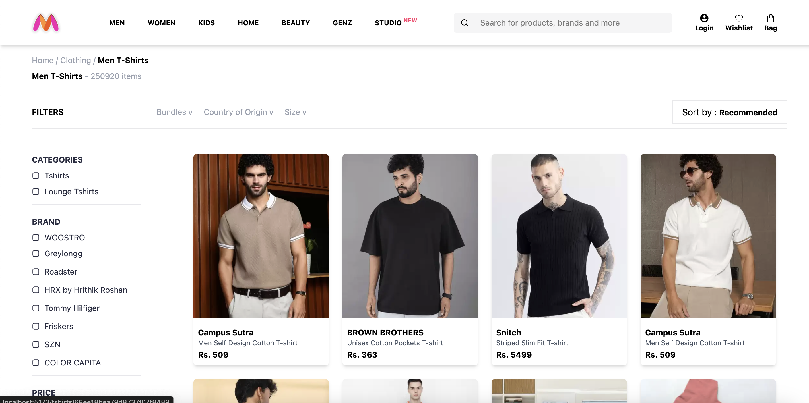
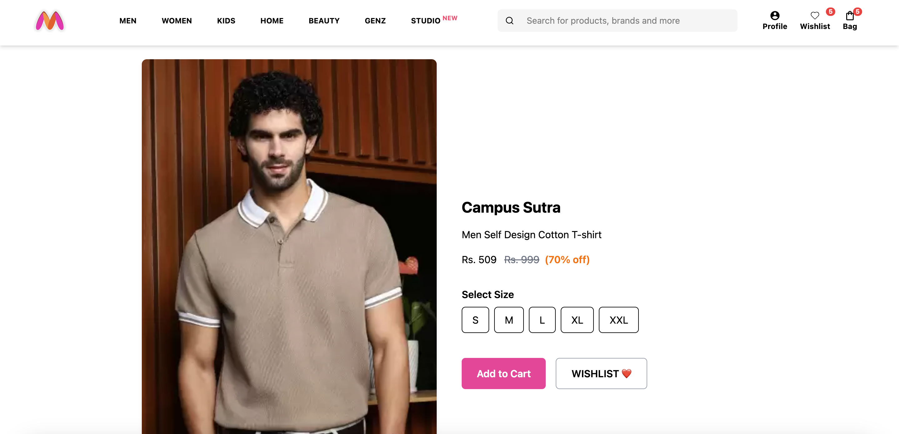
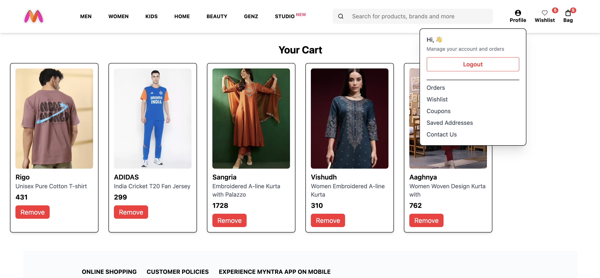
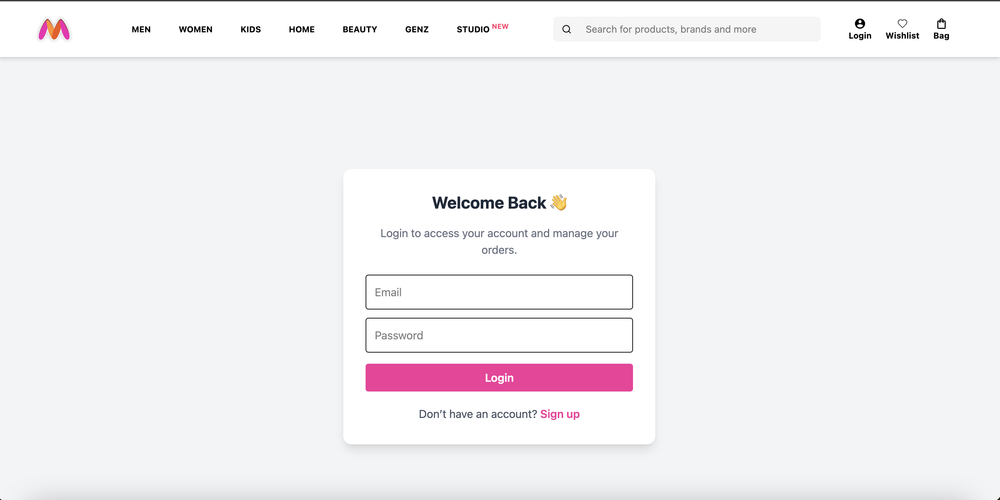
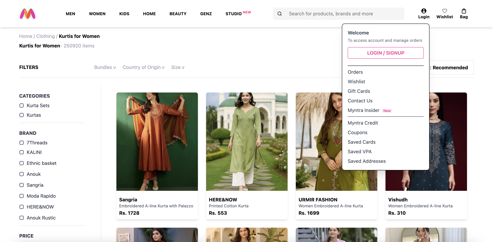
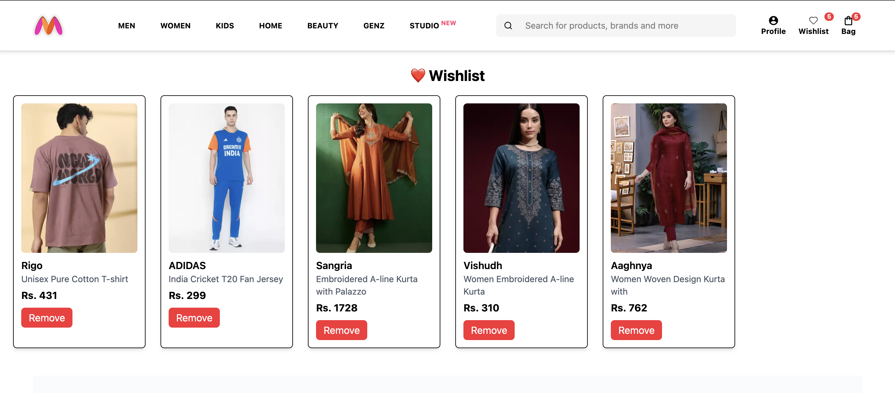

🛍️ Myntra Clone — Full Stack E-Commerce Website

A fully functional Myntra Clone built using React.js, Tailwind CSS, Node.js, Express, and MongoDB.
This project replicates the core features and design of the Myntra shopping platform, providing a smooth and modern shopping experience with authentication, wishlist, cart, and responsive UI.

Live Demo
🔗 https://ecommerce-clone-project.netlify.app/

Tech Stack
Frontend.       Backend.    Database.   Tools
React.js.       Node.js.    MongoDB.    Git, GitHub
Tailwind CSS.   Express.js  Mongoose.   Netlify

Key Features
	• Cart Management: Add, update, and remove products from the shopping cart.
	• Wishlist System: Save your favorite products to your wishlist.
	• Authentication: Secure login and signup using JWT.
	• Order & Account Management: Users can view and manage their orders.
	• State Management: Context API used for cart, wishlist, and auth states.
	• Responsive UI: Fully optimized for mobile, tablet, and desktop screens.
	• Deployed on Netlify: Fast and reliable hosting with CI/CD from GitHub.

Screenshots :
### Home Page

  
  

<!--  -->
<!--  -->

### Product Listing Page

### Cart Page

### Profile Page

### Wishlist Page

